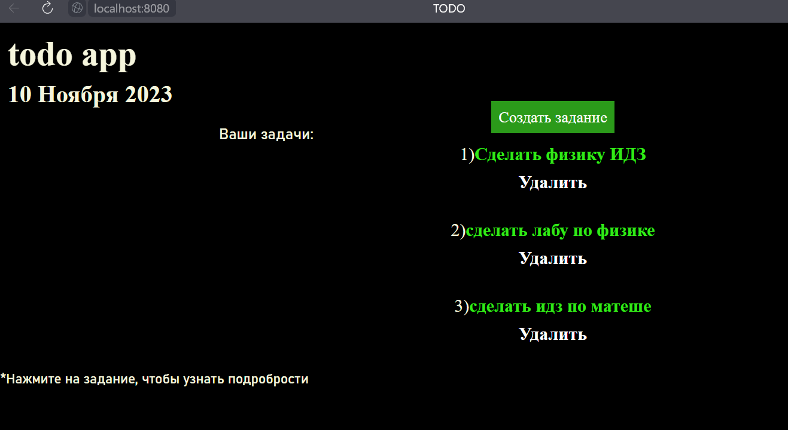

# TODO App
*I was learning java (java spring). And it's like interim results*
______
***stack:***
+ Java Spring
+ Hibernate
+ PostgreSql
+ HTML/CSS

***quick start:***
```shell
git clone https://github.com/Max1m3L/TODO-Application.git
```
```shell
cd todoApp
```
```
then start -> TodoAppApplication.java
(todoApp\src\main\java\com\maxlvshv\todoapp)
```
```
and last open -> http://localhost:8080/
```
****p.s.**** Only if you have java and PostrgeSql in your PC
***later i'll do a docker file for easy start***

****p.p.s. now in russia language and looks like this****

___________

